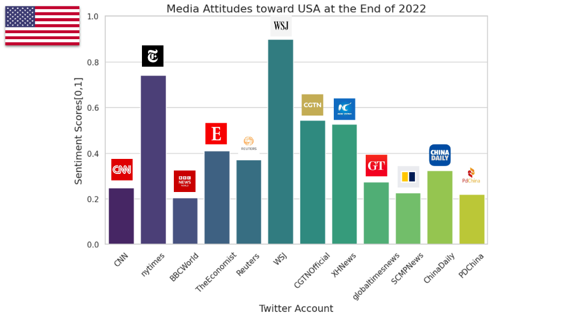
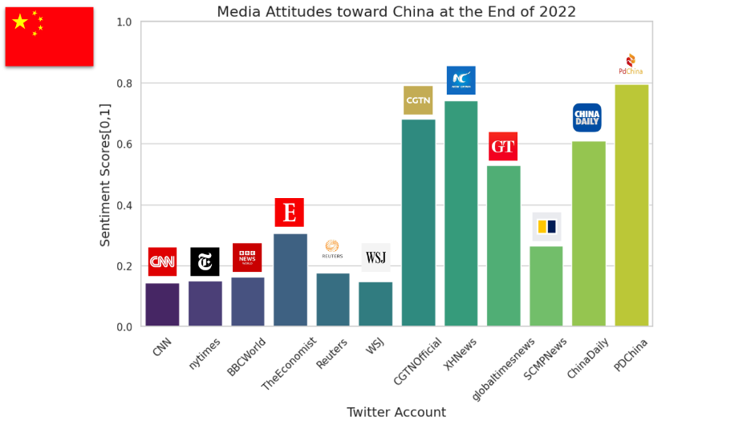
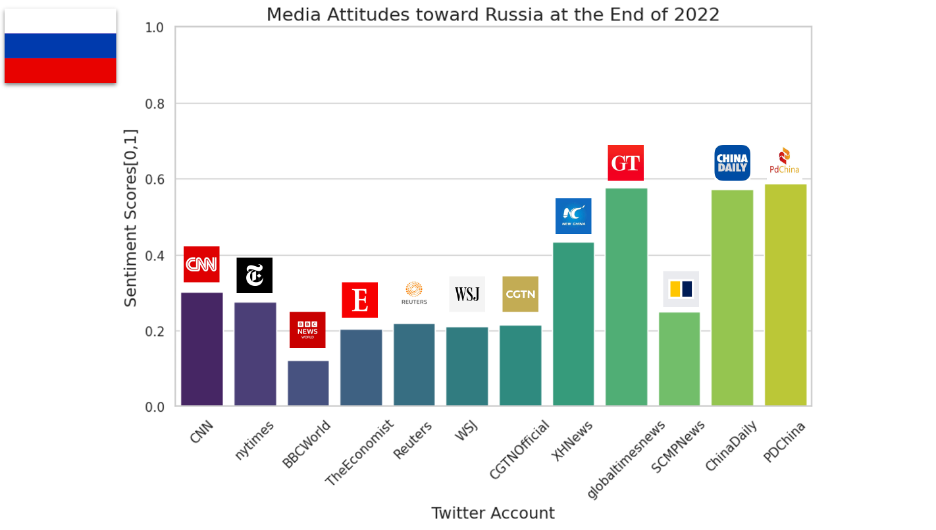
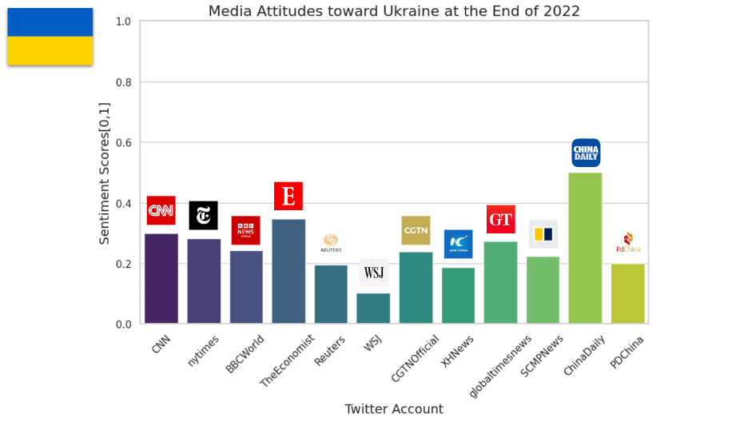

# Media-Analysis
This project uses Natural Language Processing to gain insight into 12 mainstream media’s attitudes towards 5 geopolitical entities (USA, China, Taiwan, Russia, and Ukraine) at the end of 2022.

# Results

.png)

